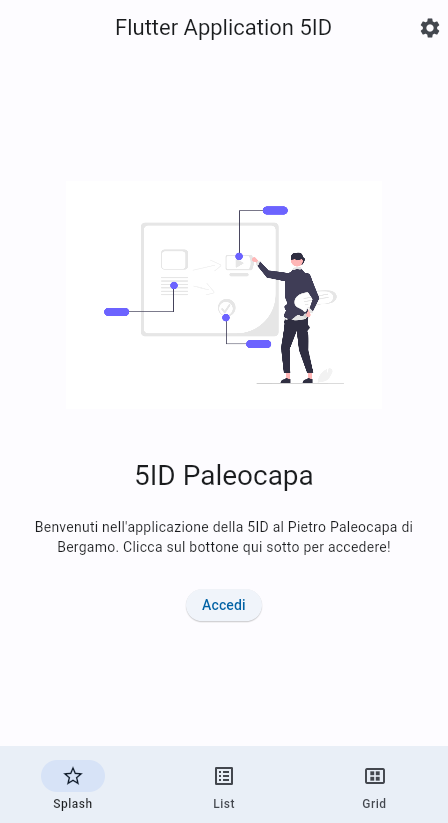
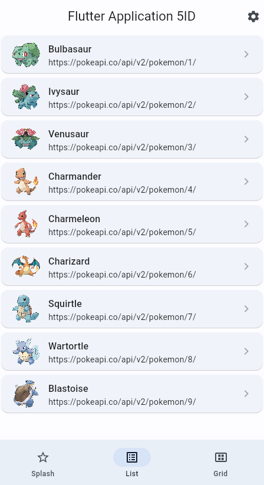
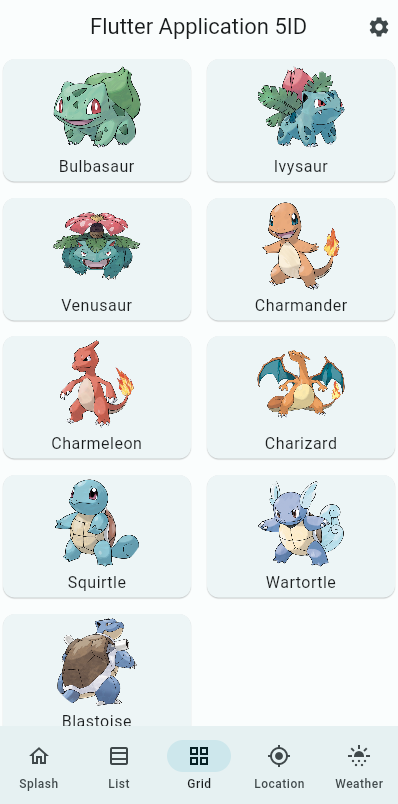
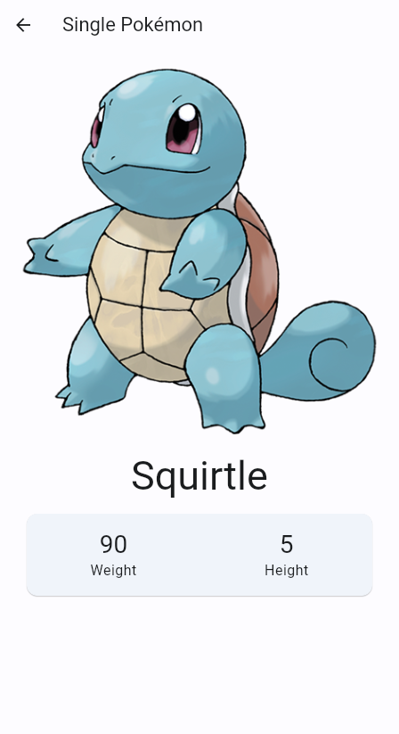
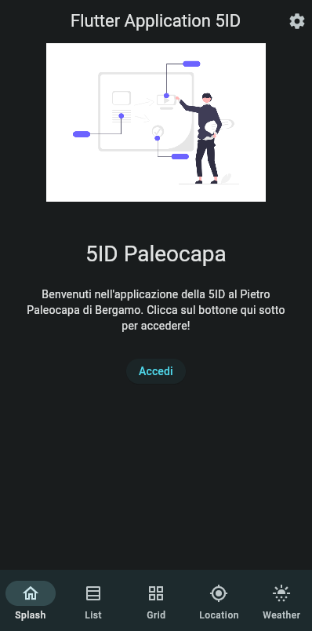
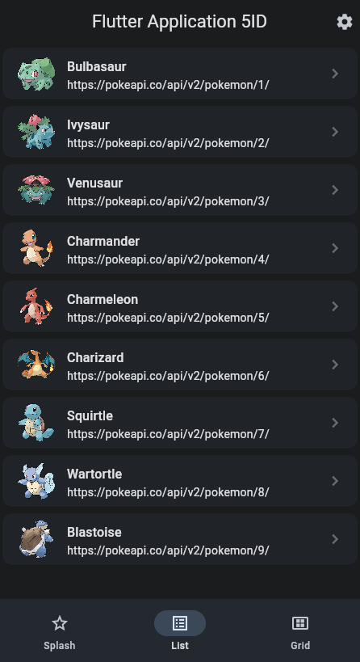
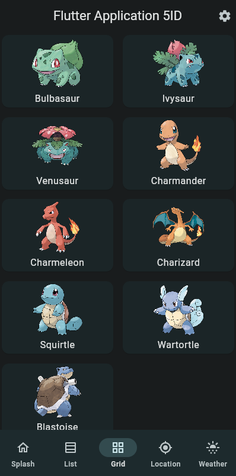
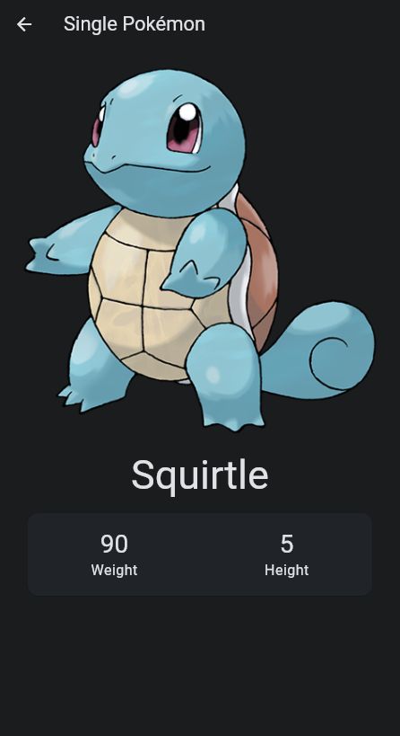

# Flutter Demo

Codice dell'applicazione di esempio realizzata durante la parte di demo per mostrare le caratteristiche di Flutter.

## Caratteristiche

* Pagina con visualizzazione di un layout d'esempio di una splash screen
* Pagina con una lista di elementi e tap su riga per andare alla pagina di dettaglio
* Pagina con una griglia di elementi e tap su card per andare alla pagina di dettaglio
* Pagina di dettaglio con chiamata HTTP per ottenere informazioni da servizio API remoto
* Interfacciamento con le [PokeAPI - The RESTful Pokémon API](https://pokeapi.co/)
* Piccola personalizzazione del tema
* Esempio di swith tra light e dark theme

## 📱 Screenshots

| Screenshot #1 | Screenshot #2 | Screenshot #3 | Screenshot #4 |
| - | - | - | - |
|  |  |  |  |
|  |  |  |  |

## 💎 Contributing

If you have any idea, feel free to fork it and submit your changes back to me.

## 📋 License

```
Copyright 2023 Alberto Bonacina

Licensed under the Apache License, Version 2.0 (the "License");
you may not use this file except in compliance with the License.
You may obtain a copy of the License at

   http://www.apache.org/licenses/LICENSE-2.0

Unless required by applicable law or agreed to in writing, software
distributed under the License is distributed on an "AS IS" BASIS,
WITHOUT WARRANTIES OR CONDITIONS OF ANY KIND, either express or implied.
See the License for the specific language governing permissions and
limitations under the License.
```
