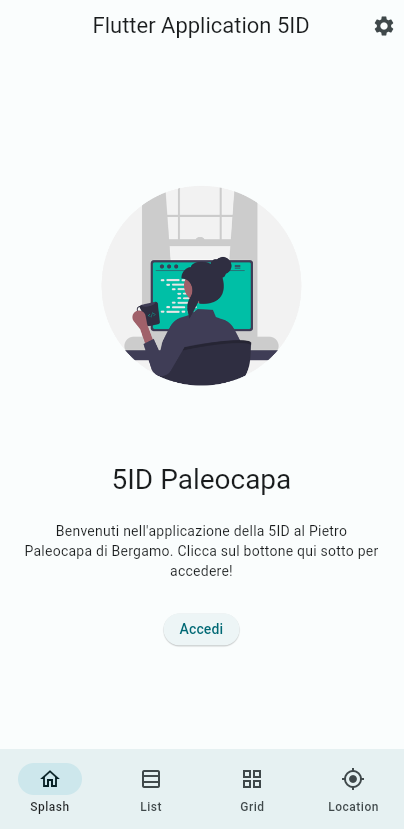
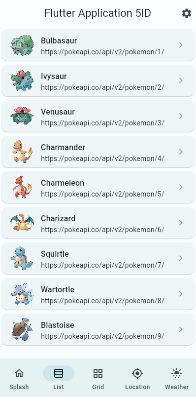
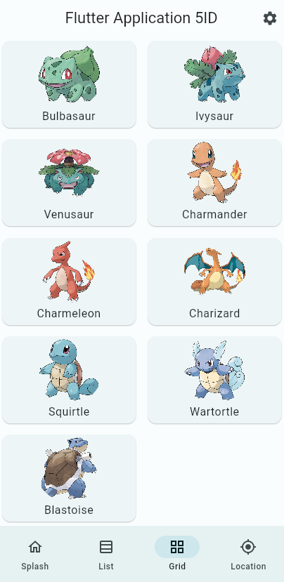
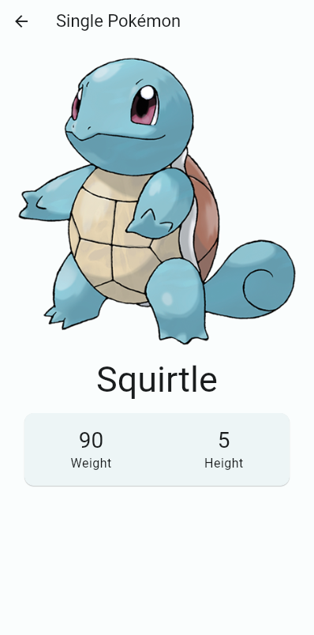
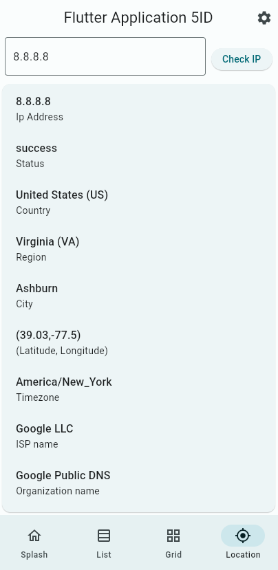
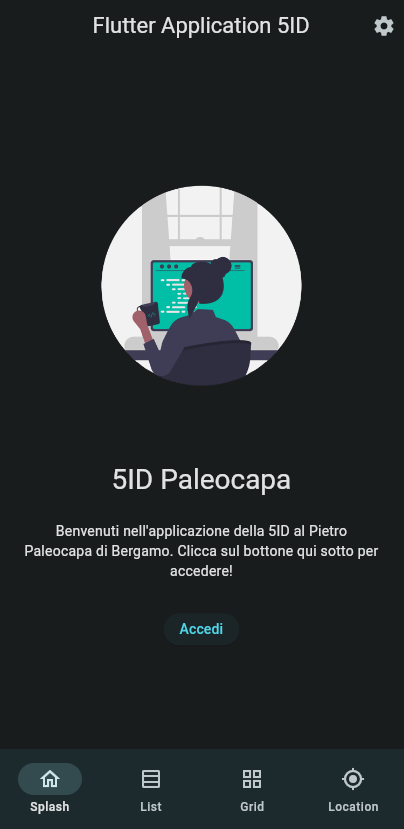
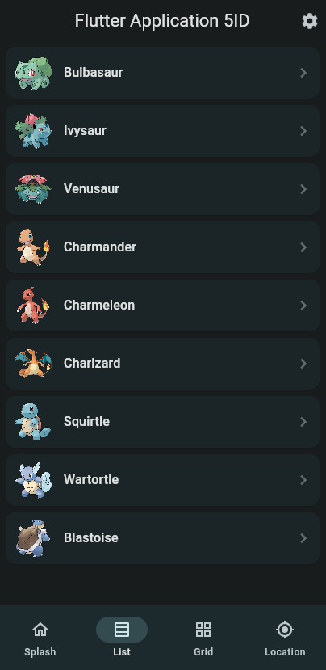
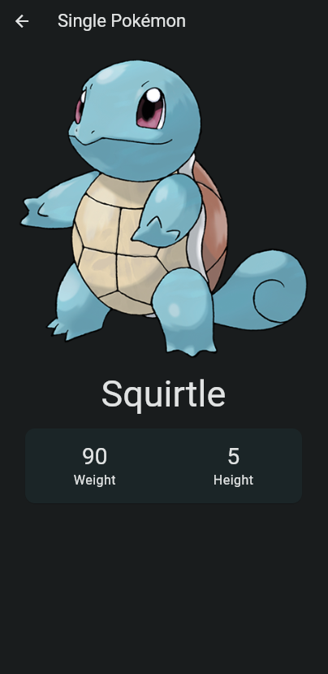
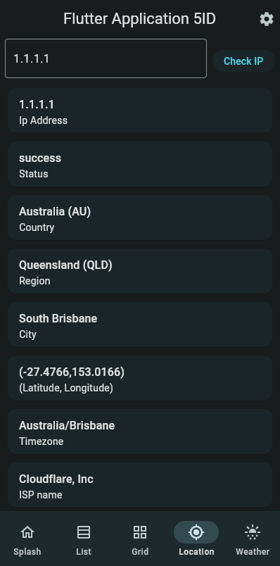

# Flutter Demo

Codice dell'applicazione di esempio realizzata durante la parte di demo per mostrare le caratteristiche di Flutter.

## Caratteristiche

* Piccola personalizzazione del tema e dei font
* Pagina con visualizzazione di un layout d'esempio di una splash screen
* Pagina con una lista di elementi e tap su riga per andare alla pagina di dettaglio
* Pagina con una griglia di elementi e tap su card per andare alla pagina di dettaglio
* Pagina di dettaglio con chiamata HTTP per ottenere informazioni da servizio API remoto
* Interfacciamento con le [Pokémon - The RESTful Pokémon API](https://pokeapi.co/) per avere le informazioni su un singolo Pokémon
* Interfacciamento con le [IP Geolocation API](https://ip-api.com/) per ottenere informazioni geolocalizzate sulla base dell'indirizzo IP

#### Assets

Nella cartella [assets/json/](assets/json/) sono stati salvati dei json di esempio da utilizzare come base di partenza per la creazione di layout nell'applicazione.

## 📱 Screenshots

| Home                                      | Lista                                   | Griglia                                 | Single Page                               | Ip Location                                    |
| ----------------------------------------- | --------------------------------------- | --------------------------------------- | ----------------------------------------- | ---------------------------------------------- |
|  |  |  |  |  |
|   |   |   |   |   |

## 💎 Contributing

Se hai qualche idea, sentiti libero di inviarmi le tue modifiche nella sezione delle [issue](https://github.com/polilluminato/presentazione-flutter-paleocapa-2023/issues) o con una pull request.

## 📋 License

```
Copyright 2023 Alberto Bonacina

Licensed under the Apache License, Version 2.0 (the "License");
you may not use this file except in compliance with the License.
You may obtain a copy of the License at

   http://www.apache.org/licenses/LICENSE-2.0

Unless required by applicable law or agreed to in writing, software
distributed under the License is distributed on an "AS IS" BASIS,
WITHOUT WARRANTIES OR CONDITIONS OF ANY KIND, either express or implied.
See the License for the specific language governing permissions and
limitations under the License.
```
