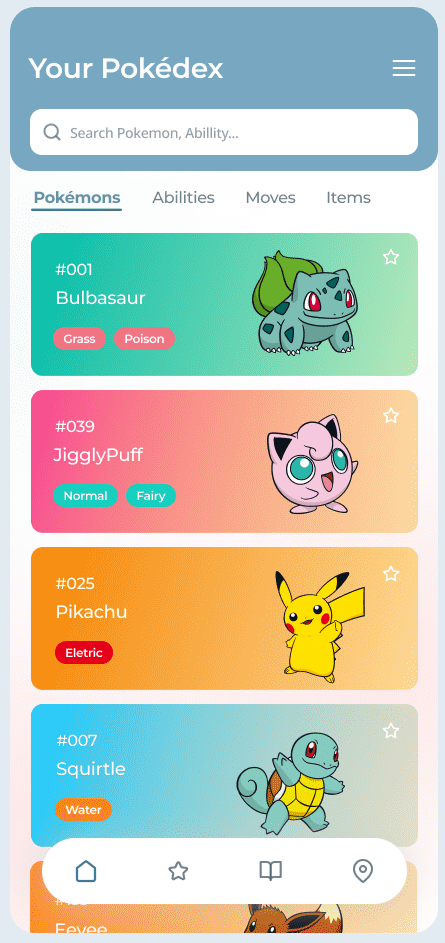
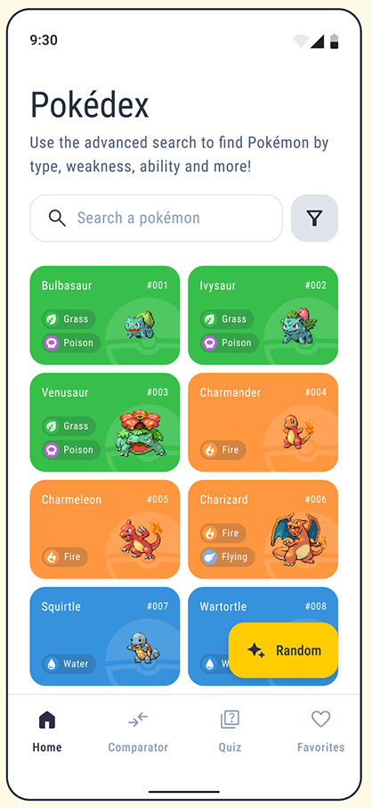
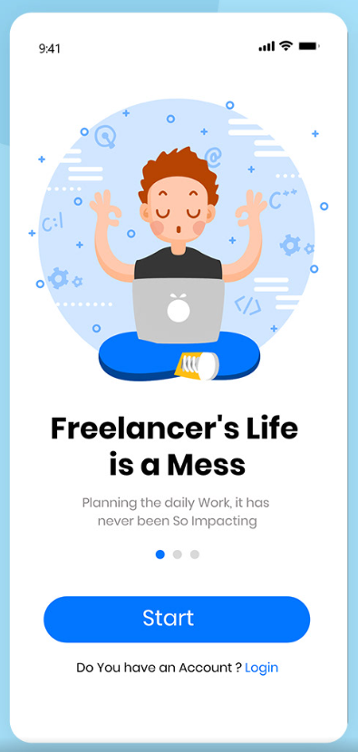
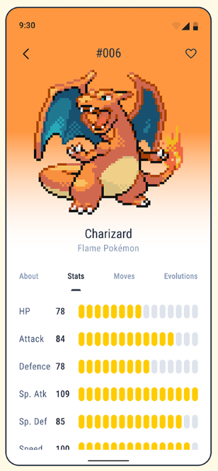
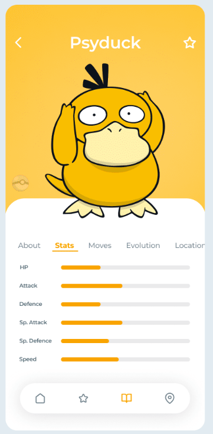

# Flutter 5ID Paleocapa

## Init progetto

Creiamo un file `main.dart` con al suo interno

```dart
void main() {
  runApp(const MyApp());
}

class MyApp extends StatelessWidget {
  const MyApp({super.key});

  @override
  Widget build(BuildContext context) {
    return MaterialApp(
      debugShowCheckedModeBanner: false,
      theme: ThemeData(
        useMaterial3: true,
        colorSchemeSeed: Colors.grey,
        brightness: Brightness.light,
      ),
      home: const MyHomePage(title: 'Flutter Application 5ID'),
    );
  }
}

class MyHomePage extends StatelessWidget {
  const MyHomePage({super.key, required this.title});

  final String title;

  @override
  Widget build(BuildContext context) {

    return Scaffold(
      body: Center(
        child: Text(title)
      ),
    );
  }
}
```

Prendi il layout e prova ad applicare un po' di stili al testo

```dart
Container(
	margin: const EdgeInsets.symmetric(vertical: 32, horizontal: 16),
	child: Text(
		'Flutter Application 5ID',
		style: TextStyle(
			color: colorScheme.primary,
			fontSize: 34,
			fontWeight: FontWeight.bold,
		),
	),
),
```

Aggiungi una row, metti dei bottoni e fai vedere come disporli nello spazio che mi viene dato

```dart
Row(
	mainAxisAlignment: MainAxisAlignment.spaceAround,
	children: [
		...
	],
),
```

Aggiungi un `ColorScheme colorScheme = Theme.of(context).colorScheme;` dentro il metodo build, per lo styling dei bottoni

```dart
ElevatedButton(
    style: ElevatedButton.styleFrom(
        backgroundColor: colorScheme.primary,
        foregroundColor: colorScheme.onPrimary,
    ),
    onPressed: () {},
    child: const Text("Botttone 1"),
)
```

## Navigazione

Creiamo delle pagine nella cartella `pages` chiamate `lista_page.dart` e `splash_page.dart`. Facciamo in modo che i due bottoni nella home mandino alle pagine

```dart
onPressed: () {
	Navigator.push(
		context,
		MaterialPageRoute(builder: (context) => const SplashPage()),
	);
}
```

Contenuto della singola pagina

```dart
import 'package:flutter/material.dart';

class SplashPage extends StatelessWidget {
	const SplashPage({super.key});

	@override
	Widget build(BuildContext context) {
		return Scaffold(
			appBar: AppBar(
				title: const Text("Splash page"),
			),
			body: const Center(
				child: Text("Splash page"),
			),
		);
	}
}

```

## Pagina con la lista dei Pokémon

|  |  |
| ------------------------------ | ------------------------------ |

* [Pokémon API](https://pokeapi.co/docs/v2)
* [Pokémon List](https://pokeapi.co/docs/v2#pokemon) e [Pokémon List GET](https://pokeapi.co/api/v2/pokemon/?limit=9)
* [Pokémon Single](https://pokeapi.co/docs/v2#pokemon) e [Pokémon Single GET](https://pokeapi.co/api/v2/pokemon/1/)

Crea un file `data/pokemon_list.dart` in cui metti una lista di Pokémon già fatta

```dart
List<PokemonItem> pokemonList = [
	PokemonItem("bulbasaur", "https://pokeapi.co/api/v2/pokemon/1/"),
	PokemonItem("ivysaur", "https://pokeapi.co/api/v2/pokemon/2/"),
	PokemonItem("venusaur", "https://pokeapi.co/api/v2/pokemon/3/"),
	PokemonItem("charmander", "https://pokeapi.co/api/v2/pokemon/4/"),
	PokemonItem("charmeleon", "https://pokeapi.co/api/v2/pokemon/5/"),
	PokemonItem("charizard", "https://pokeapi.co/api/v2/pokemon/6/"),
	PokemonItem("squirtle", "https://pokeapi.co/api/v2/pokemon/7/"),
	PokemonItem("wartortle", "https://pokeapi.co/api/v2/pokemon/8/"),
	PokemonItem("blastoise", "https://pokeapi.co/api/v2/pokemon/9/")
];
```

Crea una cartella con i models per la lista Pokémon `models/pokemon_item.dart`

```dart
class PokemonItem {
	String name;
	String link;
	int? id;
	String? imageLink;

	PokemonItem(this.name, this.link) {
		//https://pokeapi.co/api/v2/pokemon/5/
		id = int.parse(link.substring(link.length - 2, link.length - 1));

		name = name[0].toUpperCase() + name.substring(1).toLowerCase();

		imageLink =
			"https://raw.githubusercontent.com/PokeAPI/sprites/master/sprites/pokemon/other/official-artwork/$id.png";
	}
}
```

Ritorna nella pagina `pages/lista_page.dart` con la lista da creare e aggiungi la lista

```dart
body: ListView.builder(
	itemCount: pokemonList.length,
	itemBuilder: (context, index) {
		PokemonItem myPokemon = pokemonList[index];
		return Text(myPokemon.name);
	},
),
```

Per rendere più bella la ui possiamo personalizzarla in diverso modo

```dart
return Card(
	child: ListTile(
		leading: Text("${myPokemon.id}°"),
		title: Text(myPokemon.name),
		subtitle: Text(myPokemon.link),
		trailing: const Icon(Icons.chevron_right),
	),
);
```

Concludi il tutto con l'immagine dell'avatar del Pokémon sulla sinistra

```dart
leading: CircleAvatar(
	radius: 26,
	backgroundColor: Colors.transparent,
	backgroundImage: NetworkImage(myPokemon.imageLink ?? ""),
),
```

## Pagina con la splash screen

|  |  |
| -------------------------------- | -------------------------------- |

Vai a prendere una immagine che vuoi da [undraw](https://undraw.co/) e crea una cartella `assets/images` in cui includere l'immagine che hai scaricato. Apri quindi il file pubspec.yaml e aggiungi la riga per permetter a Flutter di trovare l'immagine

```yaml
	assets:
		- assets/images/
```

Crea una UI simile a questa, utile per una splash page

```dart
body: Column(
	mainAxisAlignment: MainAxisAlignment.center,
	crossAxisAlignment: CrossAxisAlignment.center,
	children: [
		Image.asset("assets/images/splash.png"),
		const Text("5ID Paleocapa"),
		const Text(
			"Benvenuti nell'applicazione della 5ID al Pietro Paleocapa di Bergamo. Clicca sul bottone qui sotto per accedere!",
			textAlign: TextAlign.center,
		),
		ElevatedButton(
			onPressed: () {},
			child: const Text("Accedi"),
		)
	],
),
```

Per rendere il tutto più bello e coerente con il material theme si possono dichiarare due variabili che ci possono aiutare con il tema

```dart
@override
Widget build(BuildContext context) {
	ColorScheme colorScheme = Theme.of(context).colorScheme;
	TextTheme textTheme = Theme.of(context).textTheme;

	return Scaffold(
		...
	);
}
```

In questo modo possiamo farci aiutare nella struttura della pagina e nella creazione dei titoli

```dart
Padding(
	padding: const EdgeInsets.symmetric(vertical: 8),
	child: Text(
	  "5ID Paleocapa",
	  style: textTheme.headlineMedium,
	),
),
Text(
	"Benvenuti nell'applicazione della 5ID al Pietro Paleocapa di Bergamo. Clicca sul bottone qui sotto per accedere!",
	textAlign: TextAlign.center,
	style: textTheme.bodyMedium,
),
```

Per rendere la UI più immersiva possiamo "nascondere" la AppBar

```dart
appBar: AppBar(
	foregroundColor: colorScheme.primary,
	elevation: 0,
	backgroundColor: Colors.white,
	title: const Text(""),
),
```

Mostra come le due variabili del tema siano utili per mantenere il tutto coeso all'interno della app provando a cambiare lo stile.

Volendo provare a fare qualche personalizzazione sull'immagine si può anche sfruttare il media query per prendere le dimensioni della finestra e adattare la UI di consenguenza, per farlo basta aggiungere nel metodo build la seguente variabile

```dart
Size screenSize = MediaQuery.of(context).size;
```

E quindi aggiustare la grandezza dell'immagine di conseguenza

```dart
Image.asset(
	"assets/images/splash.png",
	width: screenSize.width * .7,
),
```

## Singola pagina di un Pokemon

|  |  |  |
| -------------------------------- | -------------------------------- | -------------------------------- |

Creare un file chiamato `pages/single_pokemon_page.dart`  e inizializzarlo con del codice d'esempio

```dart
import 'package:flutter/material.dart';

class SinglePokemonPage extends StatelessWidget {
	const SinglePokemonPage({super.key});

	@override
	Widget build(BuildContext context) {
		return Scaffold(
			appBar: AppBar(
				title: const Text("Single Pokémon"),
			),
			body: const Center(
				child: Text("Pokémon"),
			),
		);
	}
}
```

Impostare la navigazione dalla lista Pokèmon per andare alla singola pagina del Pokèmon

```dart
ListTile(
	onTap: () {
		Navigator.push(
			context,
			MaterialPageRoute(
				builder: (context) => const SinglePokemonPage(),
			),
		);
	},
	...
),
```

Per passare l'informazione sul Pokèmon in questione dobbiamo creare un parametro che viene passato alla nostra funzione

```dart
//Dentro list_page.dart
Navigator.push(
	context,
	MaterialPageRoute(
		builder: (context) => SinglePokemonPage(
		  pokemon: myPokemon,
		),
	),
);


//In single_pokemon_page.dart
const SinglePokemonPage({super.key, required this.pokemon});
final PokemonItem pokemon;
```

Per prima cosa possiamo far vedere l'immagine del Pokèmon come abbiamo fatto per la splash page

```dart
Center(
	child: Image.network(
		pokemon.imageLink ?? "",
		width: screenSize.width * .7,
	),
),
```

### Chiamata HTTP API Single Pokémon

Per avere maggiori informazioni su un Pokémon possiamo fare una chiamata HTTP alle API dei Pokémon. Creiamo prima di tutto un model `models/pokemon.dart` che ci servirà  per fare il parsing della risposta

```dart
class Pokemon {
	final String name;
	final int height;
	final int weight;

	Pokemon({required this.name, required this.height, required this.weight});

	factory Pokemon.fromJson(Map<String, dynamic> data) {
		String nameFromApi = data['name'] as String;
		final name =
			nameFromApi[0].toUpperCase() + nameFromApi.substring(1).toLowerCase();

		final height = data['height'] as int;
		final weight = data['weight'] as int;
		final imageLink =
			data['sprites']['other']['official-artwork']['front_default'] as String;
		return Pokemon(
			name: name, height: height, weight: weight, imageLink: imageLink);
	}
}
```

Importiamo il package `http` all'interno del nostro progetto

```yaml
dependencies:
	http: ^0.13.5
	...
```

Creiamo una funzione async che vada a leggere le informazioni sulla api

```dart
Future<Pokemon> _loadInfoPokemon() async {
	try {
		final http.Response response = await http.get(Uri.parse(pokemon.link));
		Pokemon pokemonFromAPI = Pokemon.fromJson(json.decode(response.body));
		return pokemonFromAPI;
	} catch (err) {
		print(err);
	}

	return Pokemon(name: "Error", height: 0, weight: 0);
}
```

Andiamo a modificare il body del nostro scaffold con un `FutureBuilder` in modo da andare a fare una chiamata http e farci vedere il risultato quando sarà pronto

```dart
body: FutureBuilder<Pokemon>(
	future: _loadInfoPokemon(),
	builder: (BuildContext ctx, AsyncSnapshot<Pokemon> snapshot) {
		if (snapshot.hasData) {
			Pokemon myPokemon = snapshot.data!;
			return Column(
				children: [
				Image.network(myPokemon.imageLink),
				Text(myPokemon.name),
				],
			);
		} else {
			return const Center(
				child: CircularProgressIndicator(),
			);
		}
	},
),
```

Possiamo a questo punto personalizzare la pagina per esempio andanto a creare la variabile per il `textTheme` come fatto per la pagina della splash

```dart
TextTheme textTheme = Theme.of(context).textTheme;

Text(
	myPokemon.name,
	style: textTheme.displaySmall,
),
```

All'interno della classe Pokémon abbiamo anche messo `weight` e `height` possiamo farli vedere sotto il nome del Pokémon

```dart
Card(
	margin:
		const EdgeInsets.symmetric(horizontal: 32, vertical: 16),
	child: Row(
	mainAxisAlignment: MainAxisAlignment.spaceAround,
	children: [
		Container(
		padding: const EdgeInsets.all(16),
		child: Column(
			children: [
				Text(
					"${myPokemon.weight}",
					style: textTheme.headlineMedium,
				),
				Text(
					"Weight",
					style: textTheme.bodyLarge,
				)
			],
		),
		),
		Container(
		padding: const EdgeInsets.all(16),
		child: Column(
			children: [
				Text(
					"${myPokemon.height}",
					style: textTheme.headlineMedium,
				),
				Text(
					"Height",
					style: textTheme.bodyLarge,
				)
			],
		),
		),
	],
	),
)
```

## Bottom Navigation

Per rendere la navigazione migliore nella nostra applicazione possiamo  applicare una navigazione nella pagina principale con il widget `NavigationBar`. Per fare questo prima di tutto convertiamo il widget in uno `StatefulWidget` e quindi creiamo una lista di pagine che deve essere visualizzata

```dart
class MyHomePage extends StatefulWidget {
	const MyHomePage({super.key, required this.title});

	final String title;

	@override
	State<MyHomePage> createState() => _MyHomePageState();
}

class _MyHomePageState extends State<MyHomePage> {
	int selectedTab = 0;
	List<Widget> tabList = <Widget>[
		const SplashPage(),
		const ListPage(),
		...
	];
	...
}
```

Nel metodo `build` aggiungiamo alla key `bottomNavigationBar` il widget `NavigationBar`

```dart
bottomNavigationBar: NavigationBar(
	onDestinationSelected: (int index) {
		setState(() {
			selectedTab = index;
		});
	},
	selectedIndex: selectedTab,
	destinations: const <Widget>[
		NavigationDestination(
			icon: Icon(Icons.home_outlined),
			label: 'Splash',
		),
		NavigationDestination(
			icon: Icon(Icons.table_rows_outlined),
			label: 'List',
		),
		...
	],
), 
```